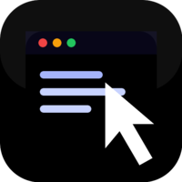

<p align="center">
  
</p>

<h1 align="center">Browser Controller</h1>

<p align="center">
  <strong>The missing piece in AI coding: your agent can now see your REAL browser.</strong>
</p>

<p align="center">
  <a href="https://github.com/compnew2006/browser-controller/actions/workflows/ci.yml"></a>
  <a href="https://github.com/compnew2006/browser-controller/releases"></a>
  <a href="LICENSE"></a>
  = 20" />
  
  
</p>

---

## What this project solves

You ship a fix. Your agent says "done, please verify."
You alt-tab to Chrome, navigate to the page, log in, click around, find the bug.

Your agent just wrote the code. It could also verify it.
It already has your browser open right there. It just can't see it.

**Now it can.** Browser Controller gives any MCP-compatible AI agent (Cursor, Claude Desktop, Windsurf, …) direct control of the **browser you already have open** — your real sessions, your logins, your cookies. No headless browser, no fresh profile, no re-authentication.

## Key capabilities

- **Multiple agents at once.** Cursor can drive tab 10 while Claude drives tab 11 — both through one shared daemon, neither blocking the other.
- **Tab targeting, not "the active tab."** Every action names a `tabId`. Move your mouse, switch tabs, watch YouTube — the agent keeps working on the tab you told it to. It never hijacks the page you're reading.
- **Per-tab isolation.** Element refs, console logs, and network buffers are scoped per tab. A ref from tab 10 can never click something in tab 20.
- **Per-tab concurrency.** Two actions on the *same* tab serialize (no races); actions on *different* tabs run in parallel.
- **Tab locking.** An agent can claim a tab so others queue behind it instead of racing (`browser_tabs { action: "lock" }`). Locks survive Chrome's service-worker recycling (`chrome.storage.session`).
- **Agent-control shield.** While an agent works on a tab you see a translucent blue inner frame and your input on that tab is blocked (mouse, keyboard, wheel) — the badge shows `agent <name> controlling the tab` and disappears when the action finishes. Locking a tab keeps a plain frame for the lock's lifetime.
- **Same-origin iframe piercing.** Legacy/enterprise UIs that live inside iframes (e.g. an ONT console in `iframe#mainFrame`) are reachable: all locator tools search iframe documents, and `find`/`click_text` walk every frame.
- **Open-dialog rescue.** A native `alert`/`confirm`/`prompt` freezes the page's JS thread — `browser_handle_dialog` dismisses it out-of-band via CDP, no page JS needed, which also un-blocks every other tool on that tab. `browser_tabs close/focus` always work, even on a frozen tab.
- **Authenticated local connection.** Token + one-time enrollment secret, so no other local process can silently drive your browser. Everything stays on localhost — no cloud, no telemetry.
- **No debugger banner.** `browser_evaluate` runs in the page's MAIN world via `chrome.scripting` — no yellow "this tab is being debugged" banner, and real values return across the MV3 world boundary.
- **Honest errors.** Every tool failure reaches your agent as a real `isError` result with the full payload — no "success" responses hiding failures mid-workflow.

---

## How it works

Three pieces, all on your machine. Nothing leaves localhost.

```
  Agent (Cursor / Claude / Windsurf)        ── other agents connect too ──┐
                  │ stdio (MCP protocol)                                   │
                  ▼                                                        ▼
  ┌─────────────────────────────┐   ┌─────────────────────────────────────────┐
  │  thin MCP client            │   │  thin MCP client                        │
  │  (node mcp-server/dist/     │   │  (node mcp-server/dist/                 │
  │   index.js)                 │   │   index.js)                             │
  │  - speaks MCP over stdio    │   │  - spawns daemon if not running         │
  │  - forwards calls to daemon │   │  - gets its own sessionId               │
  └──────────────┬──────────────┘   └────────────────────┬───────────────────┘
                 │ local IPC socket (AF_UNIX / named pipe, token-auth)     │
                 ▼                                                          ▼
  ┌──────────────────────────────────────────────────────────────────────────┐
  │  DAEMON (single long-running process, owns port 7225)                     │
  │  - multiplexes N clients → 1 extension                                    │
  │  - tags every call with the client's sessionId                            │
  │  - heartbeat eviction, per-session rate limiting                          │
  └──────────────────────────────┬───────────────────────────────────────────┘
                                 │ WebSocket ws://127.0.0.1:7225 (token-auth)
                                 ▼
  ┌──────────────────────────────────────────────────────────────────────────┐
  │  Chrome Extension (Manifest V3 service worker)                            │
  │  - resolves the target tabId (never "the active tab" implicitly)          │
  │  - serializes same-tab actions, parallelizes cross-tab actions            │
  │  - executes click/type/snapshot/evaluate against the named tab            │
  └──────────────────────────────────────────────────────────────────────────┘
```

**Key idea:** the first time any agent runs, the thin client spawns a background **daemon** that owns port 7225 and the extension connection. Every subsequent agent (even from a different MCP client) connects to that same daemon over a local IPC socket and gets its own `sessionId`. The extension sees one stable connection and routes each call to the exact tab the caller specified.

---

## Quick Start

The project is not on the Chrome Web Store or npm — you install it from this repository. Two parts: the **MCP server** (runs on your machine, talks to your AI agent) and the **Chrome extension** (sits in your browser, executes commands).

**Prerequisites:** [Node.js ≥ 20](https://nodejs.org/) and Chrome/Chromium/Edge.

### 1. Clone & build

```bash
git clone https://github.com/compnew2006/browser-controller.git
cd browser-controller
npm install
npm run build        # compiles TypeScript → mcp-server/dist/
```

### 2. Load the Chrome extension

1. Open `chrome://extensions` and enable **Developer mode** (toggle in the top right)
2. Click **Load unpacked** and select the `extension/` folder from the cloned repo
3. Pin the Browser Controller icon to your toolbar

Gray dot = waiting for the daemon. Green = connected.

### 3. Add the MCP server to your client

Cursor: Settings → MCP → "Add new MCP server". Claude Desktop: edit `claude_desktop_config.json`. Windsurf: Settings → MCP. Any MCP-compatible client works.

Replace `/path/to/browser-controller` with the **absolute path** of your clone (Windows: use `C:\\path\\to\\browser-controller\\mcp-server\\dist\\index.js`):

```json
{
  "mcpServers": {
    "browser-controller": {
      "command": "node",
      "args": ["/path/to/browser-controller/mcp-server/dist/index.js"]
    }
  }
}
```

<details>
<summary><b>Name your agent (shows in the popup)</b></summary>

By default the daemon names each connection after its parent IDE ("Cursor", "Claude", …). To override — e.g. when several agents share one IDE, or to label them by project — pass `--agent <name>` in the args. It takes priority over every auto-detection:

```json
{
  "mcpServers": {
    "browser-controller": {
      "command": "node",
      "args": ["/path/to/browser-controller/mcp-server/dist/index.js", "--agent", "My Project Agent"]
    }
  }
}
```

The name appears in the popup's **Connected Agents** list. (You can also set the `MCP_AGENT_NAME` env var — equivalent.) Reconnecting with the same name replaces the old entry, so IDE restarts don't pile up duplicates.

</details>

### 4. Pair the extension with the daemon

The daemon uses two secrets, both generated on first run into `~/.browser-controller/` (Windows: `%USERPROFILE%\.browser-controller\`). Start it once by asking your agent to "list my browser tabs", then:

1. Read the secrets:
   ```bash
   cat ~/.browser-controller/enrollment.json   # one-time pairing secret
   cat ~/.browser-controller/token.json        # WebSocket auth token
   ```
   (The enrollment secret is also printed to the MCP client's log on first run.)
2. Click the extension icon → **Settings** tab → paste the **Enrollment Secret** and the **Auth Token** (leave the port at `7225` unless you changed `WS_PORT`).

Green dot = you're connected. Your agent can now see your browser.

> These secrets prevent any other local process from opening a WebSocket and driving your authenticated browser sessions. To rotate them, stop your MCP clients, delete the folder, and the next run recreates both secrets. See [SECURITY.md](SECURITY.md) for the full threat model.

---

## Using it

The model is **tab-first**: the agent always says *which* tab to act on. It never assumes "the active tab."

### Basic workflow

1. **List tabs** to get a `tabId`:
   ```
   browser_tabs { action: "list" }
   → [{ id: 15, url: "...", title: "...", active: true, lockedBy: null }, ...]
   ```
2. **Snapshot that tab** to see its structure and get element refs:
   ```
   browser_snapshot { tabId: 15 }
   → { tree: [ { ref: "e3", role: "button", name: "Sign in" }, ... ] }
   ```
   Refs are valid **only for this tabId**. If you navigate or the DOM changes, re-snapshot. New elements since the last snapshot are tagged **`isNew: true`** — after an action opens an overlay/dropdown, the agent can focus on just those instead of re-reading the whole tree.
3. **Interact** using the ref and the same tabId:
   ```
   browser_click { tabId: 15, ref: "e3" }
   browser_type  { tabId: 15, ref: "e5", text: "hello@example.com" }
   browser_press_key { tabId: 15, key: "Enter" }
   ```
   If a ref is stale but the element still exists, it's found automatically via a robust selector + text/role scan (response carries `via: "fallback"`). If the element was scrolled away entirely (virtualized feeds), the response carries **`freshRefs: [...]`** with a fresh snapshot inline — retry with one of those new refs in the same step, no separate snapshot needed.
4. **Verify** — snapshot or read text again after the action.

### Multi-agent coordination (two agents, two tabs)

1. Agent A lists tabs, picks tab 10, optionally locks it: `browser_tabs { action: "lock", tabId: 10 }`
2. Agent B lists tabs, picks tab 11, locks it: `browser_tabs { action: "lock", tabId: 11 }`
3. Both work in parallel. Each agent's calls serialize against its own tab; the two tabs never interfere.
4. When done: `browser_tabs { action: "unlock", tabId: 10 }`.

### The popup is your control panel

A fixed-height tabbed shell (the body never scrolls, only the lists do):

- **Tabs** — every open tab with its lock owner, plus **Unlock all** in the toolbar for one-click release if an agent crashed mid-lock.
- **Agents** — each connected agent with its name, session id, uptime, and a ✕ to disconnect it immediately (clears a zombie the heartbeat hasn't reaped yet).
- **Settings** — WebSocket port, Auth Token, Enrollment Secret.
- **Activity bar** — a collapsible strip at the bottom showing the latest tool activity; expand it for the rolling log.

### Things to know

- **Forgot `tabId`?** You'll get a clear error: `tabId is required. Call browser_tabs list first.`
- **Protected pages** (`chrome://`, the Web Store, devtools) can't be scripted — you'll get `Cannot access protected page (chrome://...)` instead of a silent hang.
- **`browser_navigate`** is the one tool where `tabId` is optional (defaults to the active tab) — but for multi-agent safety, pass it explicitly. **Hash-only changes** (e.g. `/page` → `/page#section`) resolve as soon as the URL is set, without waiting for a `complete` event (SPAs don't reload on hash change, so that event never fires).
- **`browser_evaluate`** runs in the page's MAIN world (no debugger banner, CSP-safe) and returns real values (JSON-serialized across the world boundary). It's powerful but **non-idempotent** — it won't be auto-retried on timeout.
- **Scrolling virtualized feeds** (Facebook/Instagram/Twitter): `browser_scroll` returns `refsMayBeStale: true` because those sites recycle DOM nodes. Re-snapshot before your next interaction.
- **Duplicate elements**: when several elements share text+role (e.g. 3 "Like" buttons), the fallback resolver picks the correct one by ordinal (`nth`), not just the first match.
- **A frozen tab** (native dialog blocking) doesn't deadlock you: `browser_handle_dialog` dismisses it via CDP, and `browser_tabs { action: "close" }` always works as the guaranteed way out.

---

## 🧠 Teach Your Agent

The agent can use all 22 tools out of the box, but it works better when it knows the **tab-first** workflow. From the repo root:

```bash
npm run setup:cursor   # or: node mcp-server/dist/index.js --setup cursor
```

This installs:
- `~/.cursor/rules/browser-controller.mdc` — the tab-targeting workflow, dropdown handling, when to lock tabs
- `~/.cursor/commands/check-browser.md` — adds `/check-browser` to your Cursor chat

After that, type `/check-browser` in any chat. Or just say "check the result in my browser" and the agent knows what to do.

<details>
<summary>Claude Code setup</summary>

```bash
npm run setup:claude
```

Adds an `AGENTS.md` to your project root. Claude Code auto-discovers it.

</details>

See [`agent-config/`](agent-config/) for manual installation or to customize the rules.

---

## What It Can Do

22 tools. Every page-interaction tool takes a **`tabId`** (the one exception is `browser_navigate`, where it's optional).

**See**

| Tool | What it does |
|------|-------------|
| `browser_snapshot` | Accessibility tree with element refs. Compact mode (default) returns only interactive elements. Traverses shadow DOM + iframes. |
| `browser_screenshot` | Capture a tab as an image (activates the tab first to capture) |
| `browser_text` | Extract raw text from page or element |
| `browser_find` | Query elements by natural language — walks same-origin iframes too |

**Interact**

| Tool | What it does |
|------|-------------|
| `browser_click` | Click by ref or CSS selector — pierces same-origin iframes |
| `browser_click_text` | Click by visible text. Works through React portals and overlays |
| `browser_type` | Type into inputs and contenteditable fields |
| `browser_press_key` | Key combos (Enter, Escape, Ctrl+A) |
| `browser_scroll` | Scroll pages and virtual containers |
| `browser_hover` | Trigger tooltips and dropdowns |
| `browser_select` | Pick from native `<select>` dropdowns |
| `browser_wait` | Wait for elements to appear or disappear |
| `browser_fill_form` | Fill multiple form fields in one call (React/Vue-safe setters) |
| `browser_drag` | Drag element-to-element (uses CDP for reliability) |
| `browser_upload_file` | Upload files through `<input type="file">` (uses CDP, strict-CSP safe) |

**Navigate**

| Tool | What it does |
|------|-------------|
| `browser_navigate` | Go to a URL in a tab (`tabId` optional, defaults to active) |
| `browser_tabs` | List / create / close / focus / **lock** / **unlock** tabs |

**Debug & Advanced**

| Tool | What it does |
|------|-------------|
| `browser_console` | Console output (log, warn, error) — per-tab, capped at 200 entries |
| `browser_network` | XHR/fetch requests with status codes — per-tab, optional `limit` |
| `browser_evaluate` | Run JavaScript in the page's MAIN world (no banner, CSP-safe) |
| `browser_handle_dialog` | Dismiss/accept an open alert/confirm/prompt via CDP (works on frozen pages) |
| `browser_run_action` | Run a self-contained JS action object via CDP |

---

## How Others Compare

| | Browser Controller | Playwright MCP | Chrome DevTools MCP |
|---|---|---|---|
| Uses your existing browser | Yes | No, launches new | Partial, needs debug port |
| Sessions and cookies | Already there | Fresh profile | Manual setup |
| Works behind corporate SSO | Yes | No | Depends |
| Multiple agents, multiple tabs | Yes | No | No |
| Tab-targeting (won't hijack active tab) | Yes | N/A | No |
| Authenticated local connection | Yes | N/A | No |
| Setup | Build from source + extension | Headless browser | Chrome with `--remote-debugging-port` |

---

## Configuration

| Env var | Default | What it does |
|---------|---------|-------------|
| `WS_PORT` | `7225` | WebSocket port the daemon uses for the extension connection |
| `BROWSER_CONTROLLER_PROGRESSIVE` | (unset) | Set to `1` to enable progressive tool disclosure: only the `browser_tools` meta tool is visible at startup (~150 tokens instead of ~4200 for all 22 definitions). The agent discovers tools via `browser_tools {action:"list"/"search"}` and activates them with `{action:"details", tool:"…"}`. Default (unset) shows all tools upfront — safe for agents whose instructions call tools directly. |
| `MCP_AGENT_NAME` | (auto: IDE name) | Override the agent name shown in the popup (same as `--agent`) |

### Daemon state files

The daemon keeps everything in `~/.browser-controller/` (Windows: `%USERPROFILE%\.browser-controller\`):

| File | Purpose |
|------|---------|
| `enrollment.json` | One-time pairing secret for the extension (mode `0600`) |
| `token.json` | Auth token the extension must present on every WebSocket connection (mode `0600`) |
| `daemon.sock` | The IPC socket thin clients connect to (AF_UNIX on mac/linux; named pipe on Windows) |
| `daemon.json` | Daemon metadata (pid, port, start time) — used to detect a running daemon |
| `daemon.log` | Daemon stdout/stderr when spawned by a client |

To fully reset: stop your MCP clients, delete the folder, and the next run recreates it with fresh secrets.

### Reliability

- The daemon is **auto-spawned** the first time any client runs and left running detached.
- Connection drops use exponential backoff (1s → 30s), ping/pong health checks every 10s; a client that misses 3 pongs is evicted.
- Per-session rate limit of 120 calls/min protects the daemon from a runaway agent loop.
- Per-tool timeouts (5–15s for most actions, 60s for navigation), co-located with each tool's definition so they can't drift from the registry.
- **Idempotent read tools** (snapshot, screenshot, text, find) are retried on timeout; **side-effecting tools** (click, type, navigate, evaluate) — and `console`/`network` (which mutate on `clear:true`) — are **never** retried, so a click can't fire twice.
- If another process already holds port 7225, the daemon refuses to start rather than killing a process it didn't spawn — it reports the conflict so you can resolve it deliberately.

<details>
<summary>Multiple Chrome profiles</summary>

Run two daemons on different ports by setting `WS_PORT` per client:

```json
{
  "mcpServers": {
    "browser-work": {
      "command": "node",
      "args": ["/path/to/browser-controller/mcp-server/dist/index.js"]
    },
    "browser-personal": {
      "command": "node",
      "args": ["/path/to/browser-controller/mcp-server/dist/index.js"],
      "env": { "WS_PORT": "9333" }
    }
  }
}
```

Update the port in each extension popup to match.

</details>

---

## Architecture

Everything stays on your machine. The extension connects to the daemon via an authenticated WebSocket on localhost; MCP clients connect to the daemon via a local IPC socket. No cloud, no proxy, nothing leaves your browser.

```
browser-controller/
├── mcp-server/          MCP server (TypeScript)
│   └── src/
│       ├── daemon.ts        Single multi-client daemon (owns WS :7225)
│       ├── daemon-config.ts IPC protocol, paths, auth/enrollment tokens
│       ├── index.ts         Thin stdio MCP client (spawns daemon, multiplexes)
│       ├── bridge.ts        Extension WS server + cross-platform port probe
│       ├── register-tools.ts Progressive-disclosure wiring
│       └── tools/           One file per tool (22), registry pattern
├── extension/           Chrome extension (Manifest V3, plain JS, ES modules)
│   ├── background.js        Wiring only (~30 lines): inject router, register events, connect
│   ├── lib/                 state (buffers/locks/persistence), connection (WS lifecycle),
│   │                        router (dispatch + mutex/locks + control shield), page-exec,
│   │                        overlay, lock-ops, tab-concurrency (pure, unit-tested)
│   ├── handlers/            Tool implementations: navigation, interaction, inspection, tabs, cdp
│   ├── utils/               navigation + smart-selector fallback resolution
│   ├── events.js            chrome.* listeners (console capture, popup, webRequest, lifecycle)
│   ├── content.js           Console capture
│   └── popup/               Fixed tabbed shell (Tabs · Agents · Settings) + collapsible activity bar
├── agent-config/        Pre-built configs for Cursor + Claude Code
│   ├── cursor/              Rules and commands
│   ├── skills/              Browser automation skill
│   └── setup.mjs            One-command installer
└── tests/               15 suites / 215 tests
```

**Stack:** TypeScript (strict) · MCP SDK · WebSocket · Chrome Extension Manifest V3 · Vitest

## Development

```bash
git clone https://github.com/compnew2006/browser-controller.git
cd browser-controller
npm install
npm run build
npm test
```

| Command | What it does |
|---------|---------|
| `npm run build` | Compile TypeScript → `mcp-server/dist/` |
| `npm run dev` | Watch mode |
| `npm test` | Run the full test suite (215 tests) |
| `npm run typecheck` | Type check without emitting |
| `npm run setup:cursor` | Install Cursor rule + command |
| `npm run setup:claude` | Install Claude Code `AGENTS.md` |

The suite covers the WebSocket bridge (including token-auth rejection and the unified error channel), the tool registry, daemon lifecycle (heartbeat eviction, rate limiting, IPC auth), per-tab concurrency (same-tab serialization + cross-tab parallelism), and extension behavior via a mocked `chrome` API (router dispatch, shield semantics, evaluate round-trip, iframe piercing, dialog rescue). CI runs the suite on Node 20 and 22, plus CodeQL and Scorecard scans.

### Updating an existing install

```bash
git pull
npm install
npm run build
```

Then two manual steps: **reload the extension** in `chrome://extensions` (a running service worker never picks up file changes by itself), and **restart the daemon** — it's long-lived and doesn't reload `dist/` either (kill it, or just restart your MCP client, and the next run respawns it on the new build).

---

## FAQ

<details>
<summary>Does it work with my logged-in sessions?</summary>

That's the whole point. The extension runs inside your actual Chrome — same cookies, same sessions, same local storage. No re-authentication needed.

</details>

<details>
<summary>Does it send data anywhere?</summary>

No. The MCP clients, the daemon, and the extension all talk over localhost (IPC socket + WebSocket). Nothing leaves your machine. There's no analytics, no telemetry, no cloud component. See [SECURITY.md](SECURITY.md) for the threat model, auth design, and the first-contact TOFU window.

</details>

<details>
<summary>Which AI clients work?</summary>

Any MCP-compatible client. Cursor, Claude Desktop, Claude Code, Windsurf, Cline, and anything else that speaks the MCP protocol. Several of them can run at once against the same daemon.

</details>

<details>
<summary>Can two agents really work at the same time without breaking each other?</summary>

Yes. Each agent connects to the shared daemon, gets its own `sessionId`, and targets a specific `tabId`. Actions on the same tab serialize through a per-tab mutex; actions on different tabs run in parallel. Optionally an agent can `lock` a tab to claim exclusive access; other agents queue behind the lock rather than failing.

</details>

<details>
<summary>What if the agent acts on the wrong tab?</summary>

It can't — not silently. Every page-interaction tool requires a `tabId`, and if it's missing you get a clear `tabId is required` error. The agent can never accidentally act on the tab you happen to be looking at. (The one exception is `browser_navigate` without a `tabId`, which uses the active tab — but for multi-agent use you should always pass `tabId`.)

</details>

<details>
<summary>Why are there two secrets (enrollment + token)?</summary>

Without them, any local process on your machine could open a WebSocket to port 7225 and drive your authenticated browser sessions (your bank, your email, your company SSO). The enrollment secret pairs the extension with the daemon exactly once (out-of-band, before any WebSocket exists); the auth token then authenticates every connection. Both live in `~/.browser-controller/` with mode `0600`.

</details>

<details>
<summary>How is this different from Playwright MCP or browser-use?</summary>

They launch a new browser instance from scratch — no state, no cookies, no sessions. You have to replay the full login flow every time. This connects to the browser you already have open with everything already loaded.

</details>

---

## Contributing

Bug reports, feature requests, and PRs are welcome at [the issue tracker](https://github.com/compnew2006/browser-controller/issues). Open an issue first for larger changes.

## Security

See [SECURITY.md](SECURITY.md) — localhost-only architecture, token + enrollment design, threat model, and reporting guidance.

## License

[MIT](LICENSE)
