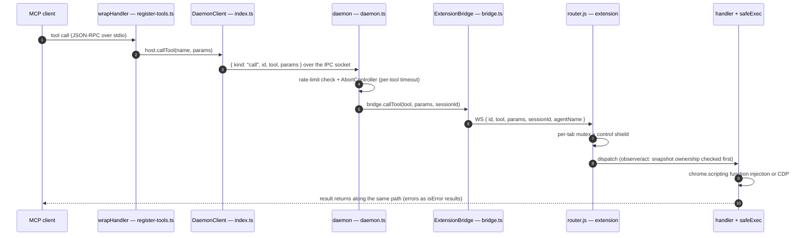

<p align="center">
  
</p>

<h1 align="center">Browser Controller</h1>

<p align="center">
  <strong>The missing piece in AI coding: your agent can now see your REAL browser.</strong>
</p>

<p align="center">
  <a href="https://github.com/compnew2006/browser-controller/actions/workflows/ci.yml"></a>
  <a href="https://github.com/compnew2006/browser-controller/releases"></a>
  <a href="LICENSE"></a>
  = 20" />
  
  
</p>

---

## What this project solves

You ship a fix. Your agent says "done, please verify."
You alt-tab to Chrome, navigate to the page, log in, click around, find the bug.

Your agent just wrote the code. It could also verify it.
It already has your browser open right there. It just can't see it.

**Now it can.** Browser Controller gives any MCP-compatible AI agent (Cursor, Claude Desktop, Windsurf, …) direct control of the **browser you already have open** — your real sessions, your logins, your cookies. No headless browser, no fresh profile, no re-authentication.

## Key capabilities

- **Multiple agents at once.** Cursor can drive tab 10 while Claude drives tab 11 — both through one shared daemon, neither blocking the other.
- **Tab targeting, not "the active tab."** Every action names a `tabId`. Move your mouse, switch tabs, watch YouTube — the agent keeps working on the tab you told it to. It never hijacks the page you're reading.
- **Per-tab isolation.** Element refs, console logs, and network buffers are scoped per tab. A ref from tab 10 can never click something in tab 20.
- **Per-tab concurrency.** Two actions on the _same_ tab serialize (no races); actions on _different_ tabs run in parallel.
- **Tab locking.** An agent can claim a tab so others queue behind it instead of racing (`browser_tabs { action: "lock" }`). Locks survive Chrome's service-worker recycling (`chrome.storage.session`).
- **Agent-control shield.** While an agent works on a tab you see a translucent blue inner frame and your input on that tab is blocked (mouse, keyboard, wheel) — the badge shows `agent <name> controlling the tab` and disappears when the action finishes. Locking a tab keeps a plain frame for the lock's lifetime.
- **Visible agent cursor (optional).** Switch on *Show agent cursor* in the popup's Settings and every agent mouse action (click, hover, wheel, drag — including `browser_act`) draws a blue pointer that glides to its target before the input lands — a ripple marks each click, the arrow presses in while dragging — so you can follow what the agent does. Off by default: the glide adds ~0.2–0.35 s to each mouse action on a visible tab (none in hidden tabs). It fades after a few idle seconds and stays out of the agent's own screenshots.
- **Same-origin iframe piercing.** Legacy/enterprise UIs that live inside iframes (e.g. an ONT console in `iframe#mainFrame`) are reachable: all locator tools search iframe documents, and `find`/`click_text` walk every frame.
- **Open-dialog rescue.** A native `alert`/`confirm`/`prompt` freezes the page's JS thread — `browser_handle_dialog` dismisses it out-of-band via CDP, no page JS needed, which also un-blocks every other tool on that tab. `browser_tabs close/focus` always work, even on a frozen tab.
- **Authenticated local connection.** Token + enrollment secret, so no other local process can silently drive your browser — and after a one-time `npm run setup:pairing` the extension pairs itself, no secret to paste. Everything stays on localhost — no cloud, no telemetry.
- **Versioned compatibility handshake.** The daemon and extension advertise an application-protocol version, build version, and capabilities before tool traffic is accepted. Explicitly incompatible protocol majors fail with an actionable error instead of producing unexplained timeouts; the build version is diagnostic and does not by itself make compatible peers fail.
- **Real, trusted input.** Clicks, typing and key presses go through the Chrome DevTools Protocol, so the page sees `isTrusted` events, focus really moves, default actions run (Tab moves focus, Enter submits, arrows drive autocomplete menus) and focus/blur fire even while the window is in the background — legacy grids and lookup widgets behave as they do for a person. One debugger session per tab is reused and detached after 30 s idle (the yellow "being debugged" banner shows only while it is attached). Pass `trusted: false` for the old synthetic events with no banner; they are also the automatic fallback when the debugger can't attach.
- **Batches.** `browser_batch` runs a list of tool calls in one round-trip and stops at the first failure — a click → type → Tab → wait → read sequence is one call instead of five.
- **Console-style JavaScript.** `browser_evaluate` accepts code as you'd type it in DevTools: top-level `await`, several statements, the last expression's value is returned, DOM nodes come back as readable descriptions — and page CSP doesn't block it.
- **Refs that stay right.** Snapshot/find refs resolve through one shared page runtime: the registered element first, then the first *visible* selector match (across open and closed shadow roots and same-origin iframes), then a verified fallback that only re-binds when role, tag and name identify one element — an ambiguous match is reported as gone instead of clicked. Hidden duplicates are skipped.
- **Native Chrome accessibility tree.** `browser_snapshot { source: "native" }` reads the tree Chrome itself computes (CDP `Accessibility.getFullAXTree`): exact roles, accessible names (`aria-labelledby`, `<label>`, native widget semantics), states (`checked`, `expanded`, `invalid`, heading `level`…) and `aria-hidden`/`inert` exclusion — what a screen reader sees. Its refs work with every ref tool, including inside closed shadow roots and same-origin iframes. Opt-in; the default `source: "dom"` needs no debugger.
- **Shadow DOM everywhere.** `snapshot`, `text`, `find`, `click_text`, `wait` and every locator see web components (open and closed roots, slots), so sites like caniuse read like any other page.
- **Frozen tabs don't freeze the agent.** Every page call has an 8 s budget; a tab that stops answering is reported as `TAB_WEDGED` in seconds, later calls fail fast after a 1.5 s probe, and `browser_navigate` / `browser_tabs reload` replace the frozen tab in place (the result carries the new `tabId`).
- **Coordinates when you need them.** Click, hover and wheel-scroll at `x`/`y`, triple-click, ctrl/shift-click, key sequences with `repeat`, and zoomed `region` screenshots that tell you how image pixels map to those coordinates.
- **Record and replay.** [`browser_gif`](#browser_gif) records what the agent does in a tab as an animated GIF you can show to a person — a frame after every page-changing action, and `export` writes the file and returns its path; [`browser_shortcuts`](#browser_shortcuts) saves a flow with `{{variables}}` and replays it in one call.
- **Several browsers.** Every connected Chrome profile is its own connection; `browser_list_browsers` / `browser_select_browser` pick one per session (one browser behaves exactly as before).
- **Honest errors.** Every tool failure reaches your agent as a real `isError` result with the full payload — no "success" responses hiding failures mid-workflow.

---

## How it works

Three pieces, all on your machine. Nothing leaves localhost. The daemon control plane is hard-bound to `127.0.0.1`; there is no supported remote/n8n listener.


```mermaid
flowchart LR
    subgraph Client["MCP client (Cursor / Claude / Windsurf)"]
        A["agent"]
    end

    subgraph Thin["thin MCP client — mcp-server/dist/index.js"]
        B["DaemonClient<br/>speaks MCP over stdio<br/>spawns daemon if not running<br/>gets its own sessionId"]
    end

    subgraph Daemon["daemon — single long-running process, owns port 7225"]
        C["daemon.ts<br/>multiplexes N clients → 1 extension<br/>sessions · rate limit · heartbeats"]
        D["bridge.ts (ExtensionBridge)<br/>HTTP /pair /status /kill<br/>WebSocket for the extension"]
    end

    subgraph Ext["Chrome extension (Manifest V3 service worker)"]
        E["connection.js<br/>pairing · reconnect backoff"]
        F["router.js<br/>tool dispatch"]
        G["tab-concurrency.js<br/>per-tab mutex · locks · shield"]
        H["handlers/*<br/>interaction · inspection · agent-api<br/>cdp · navigation · tabs"]
        I["page-exec.js safeExec<br/>chrome.scripting func: — CSP-safe"]
        E --> F --> G --> H --> I
    end

    P["Page — your real sessions"]

    A -->|stdio MCP| B
    B -->|IPC socket + token| C
    C --> D
    D <-->|Authenticated WebSocket<br/>protocol version + capabilities| E
    I --> P
```

**Key idea:** the first time any agent runs, the thin client spawns a background **daemon** that owns port 7225 and the extension connection. Every subsequent agent (even from a different MCP client) connects to that same daemon over a local IPC socket and gets its own `sessionId`. The extension sees one stable connection and routes each call to the exact tab the caller specified.

---

## Quick Start

The project is not on the Chrome Web Store or npm — you install it from this repository. Two parts: the **MCP server** (runs on your machine, talks to your AI agent) and the **Chrome extension** (sits in your browser, executes commands).

**Prerequisites:** [Node.js ≥ 20](https://nodejs.org/) and Chrome/Chromium/Edge.

### 1. Clone & build

```bash
git clone https://github.com/compnew2006/browser-controller.git
cd browser-controller
npm install
npm run build        # compiles TypeScript → mcp-server/dist/
```

### 2. Load the Chrome extension

1. Open `chrome://extensions` and enable **Developer mode** (toggle in the top right)
2. Click **Load unpacked** and select the `extension/` folder from the cloned repo
3. Pin the Browser Controller icon to your toolbar

Gray dot = waiting for the daemon. Green = connected.

### 3. Add the MCP server to your client

Cursor: Settings → MCP → "Add new MCP server". Claude Desktop: edit `claude_desktop_config.json`. Windsurf: Settings → MCP. Any MCP-compatible client works.

Replace `/path/to/browser-controller` with the **absolute path** of your clone (Windows: use `C:\\path\\to\\browser-controller\\mcp-server\\dist\\index.js`):

```json
{
  "mcpServers": {
    "browser-controller": {
      "command": "node",
      "args": ["/path/to/browser-controller/mcp-server/dist/index.js"]
    }
  }
}
```

<details>
<summary><b>Name your agent (shows in the popup)</b></summary>

By default the daemon names each connection after its parent IDE ("Cursor", "Claude", …). To override — e.g. when several agents share one IDE, or to label them by project — pass `--agent <name>` in the args. It takes priority over every auto-detection:

```json
{
  "mcpServers": {
    "browser-controller": {
      "command": "node",
      "args": [
        "/path/to/browser-controller/mcp-server/dist/index.js",
        "--agent",
        "My Project Agent"
      ]
    }
  }
}
```

The name appears in the popup's **Connected Agents** list. (You can also set the `MCP_AGENT_NAME` env var — equivalent.) Reconnecting with the same name replaces the old entry, so IDE restarts don't pile up duplicates.

</details>

### 4. Pair the extension with the daemon

Run this once from the repo root:

```bash
npm run setup:pairing
```

Then click **Reload** on Browser Controller in `chrome://extensions`. The extension pairs itself — nothing to copy or paste. Green dot = you're connected. Your agent can now see your browser.

What the command sets up:

- A small local helper (a Chrome **native messaging host**, `mcp-server/dist/native-host.js`), registered with every Chromium browser it finds: Chrome (stable, Beta, Canary), Chromium, Edge and Brave. It is a per-user install (on Windows, under `HKCU\Software\…\NativeMessagingHosts`) and needs no admin rights.
- Chrome lets only this extension's ID start the helper. An unpacked extension's ID comes from its folder path; the command prints the ID it computed, and it must match the one shown in `chrome://extensions`. If you loaded the extension from another folder, pass its ID: `npm run setup:pairing -- --extension-id <id>`.
- A launcher in `.native-host/` that pins the current `node`, because a browser started from the Dock or Start menu does not see your shell's `PATH`.

The extension asks the helper only when the daemon refuses its secret — the first time, and after you rotate the secrets — so a rotation needs no action either. Check the setup with `npm run pairing:status` (it never prints the secret) and remove it with `npm run pairing:uninstall`. Run `npm run setup:pairing` again after moving the repository or switching Node installations, since the launcher pins both paths. When pairing cannot happen, the popup's activity log says why and what to run.

<details>
<summary><b>Pair by hand instead</b></summary>

Only the enrollment secret is needed — the extension fetches the auth token from the daemon by itself.

1. Start the daemon once by asking your agent to "list my browser tabs". It creates the secrets in `~/.browser-controller/` (Windows: `%USERPROFILE%\.browser-controller\`), and the MCP client prints the enrollment secret to its log on first run.
2. Copy the `secret` value:
   ```bash
   cat ~/.browser-controller/enrollment.json
   ```
3. Click the extension icon → **Settings** tab → paste it into **Enrollment Secret** (leave the port at `7225` unless you changed `WS_PORT`).

</details>

> These secrets prevent any other local process from opening a WebSocket and driving your authenticated browser sessions. To rotate them, stop your MCP clients, delete the folder, and the next run recreates both secrets. See [SECURITY.md](SECURITY.md) for the full threat model, including why the pairing helper does not weaken it.

### Runtime lifecycle (authoritative daemon)

The **daemon** is the only process that owns the extension-facing runtime. MCP
clients are thin stdio adapters and may start it automatically, but deployment
scripts should use the lifecycle commands below so there is one restart owner.
Do not run a second `daemon.js` or install a launch supervisor that competes for
port `7225`.

```bash
npm run build
npm run daemon:start      # start, or report the already-running PID
npm run daemon:status     # JSON health/runtime information
npm run daemon:stop       # graceful SIGTERM; removes runtime metadata
npm run daemon:restart    # stop, then start; preserves token/enrollment
```

The daemon survives browser/Chrome restarts: token, enrollment secret, and
pairing remain in `~/.browser-controller/` (override with `BC_STATE_DIR`), and
the extension reconnects to the same endpoint. The lifecycle wrapper reads the
`daemon.json` PID and is safe to run repeatedly; a stale lock is removed only
when its recorded PID is not alive.

### Expected endpoints

- **MCP endpoint:** stdio, launched as `node mcp-server/dist/index.js` (the
  standard `mcpServers` command/args form is shown above).
- **Extension runtime:** `ws://127.0.0.1:7225` by default, with HTTP
  `/pair`, `/status`, and `/kill?sessionId=...` on the same port. These are
  daemon/popup endpoints, not an MCP HTTP transport.
- **MCP client IPC:** `~/.browser-controller/daemon.sock` on Unix or
  `\\.\pipe\browser-controller` on Windows. It is internal and token-authenticated.
- **State:** `~/.browser-controller/{daemon.json,daemon.lock,token.json,
  enrollment.json,daemon.log}`. `WS_PORT`, `WS_HOST`, and `BC_STATE_DIR` are the
  supported configuration overrides.

This preserves the real Chrome session workflow: no Playwright/headless browser
is launched, and the existing Chrome profile, cookies, logins, and tabs remain
the browser being controlled.

### Permission and trust boundary

The unpacked extension deliberately requests Chrome's powerful `debugger`, `scripting`, `webRequest`, and `<all_urls>` permissions, plus `nativeMessaging`, which it uses only to ask the local pairing helper for the enrollment secret. They are what let it inspect network activity, inject functions, upload files through CDP, and automate any normal web tab you select. They also mean a connected MCP agent can read and change sensitive pages in your signed-in browser. Install the extension only from source you trust, pair it only with a trusted local daemon, and do not expose the daemon port beyond localhost. Chrome-protected pages such as `chrome://`, the Web Store, and DevTools remain inaccessible.

---

## Using it

The model is **tab-first**: the agent always says _which_ tab to act on. It never assumes "the active tab."

### Basic workflow

1. **List tabs** to get a `tabId`:
   ```
   browser_tabs { action: "list" }
   → [{ id: 15, url: "...", title: "...", active: true, lockedBy: null }, ...]
   ```
2. **Snapshot that tab** to see its structure and get element refs:
   ```
   browser_snapshot { tabId: 15 }
   → { tree: [ { ref: "e3", role: "button", name: "Sign in" }, ... ] }
   ```
   Refs are valid **only for this tabId**. If you navigate or the DOM changes, re-snapshot. New elements since the last snapshot are tagged **`isNew: true`** — after an action opens an overlay/dropdown, the agent can focus on just those instead of re-reading the whole tree.
3. **Interact** using the ref and the same tabId:
   ```
   browser_click { tabId: 15, ref: "e3" }
   browser_type  { tabId: 15, ref: "e5", text: "hello@example.com" }
   browser_press_key { tabId: 15, key: "Enter" }
   ```
   If a ref is stale but the element still exists, it's found automatically via a robust selector + text/role scan (response carries `via: "fallback"`). If the element was scrolled away entirely (virtualized feeds), the response carries **`freshRefs: [...]`** with a fresh snapshot inline — retry with one of those new refs in the same step, no separate snapshot needed.
4. **Verify** — snapshot or read text again after the action.

### Native accessibility tree

`browser_snapshot` has two sources. Both return the same shape (`ref`, `role`, `name`, `value`, state flags, `href`, `children`) and their refs are interchangeable with every ref tool.

| | `source: "dom"` (default) | `source: "native"` |
|---|---|---|
| Built from | A walk of the DOM with ARIA rules re-implemented in the extension | Chrome's accessibility engine, via CDP `Accessibility.getFullAXTree` |
| Roles / names / states | Approximation (explicit `role`, tag map, `aria-label`, `<label>`, text) | Exactly what assistive technology gets: name computation, native widget roles, `checked` / `expanded` / `invalid` / heading `level`, `aria-hidden` and `inert` honoured |
| Debugger | Not used (no banner) | Attached (yellow "being debugged" banner, same as trusted input) |
| Cost | ~tens of ms on typical pages | Same, plus Chrome's tree computation: roughly 2 s per 40k accessibility nodes on a very large page |
| Custom clickable `<div tabindex>` | Listed | Listed only when it has an accessible name (Chrome calls it `generic`) |
| If unavailable | — | Falls back to the DOM tree and adds `nativeUnavailable: "<reason>"` |

```
browser_snapshot { tabId: 15, source: "native" }
→ { source: "native", tree: [ { ref: "s4k2-3", role: "textbox", name: "Search query", value: "abc", required: true }, … ] }
browser_snapshot { tabId: 15, source: "native", selector: "form", compact: false }   // scoped, full tree incl. text
```

How refs are bound: every accessibility node carries a `backendDOMNodeId`; the extension resolves it to its element (closed shadow roots and same-origin iframes included) and registers it in the same page-side ref registry the DOM snapshot uses — no attribute or other mutation of the page. Because of that, `click` / `type` / `hover` / `select` / `scroll` / `drag` / `fill_form` act on the exact element (two buttons both named "Save" stay distinct) and keep the stale-ref fallback and `isNew` behaviour. Limits: at most 1500 refs per snapshot (`refLimited: true` when hit); cross-origin (out-of-process) iframes are reported in `skippedFrames`; controls with no page element to act on — Chrome-internal parts such as the sub-fields and picker button inside a date input, or an element that vanished mid-snapshot — are left out of the compact tree and listed without a `ref` in the full tree, counted in `unreachableNodes`.

### Safe Observe → Act workflow

For automation that must fail safely when a page changes, use the Browser Controller 2.0 agent API. `browser_observe` captures one compact semantic state in a single page execution and returns session-, tab-, document-, and snapshot-owned refs:

```text
browser_observe { tabId: 15, mode: "compact" }
→ {
    snapshotId: "s_…",
    documentVersion: "d_…:1:0",
    elements: [
      { ref: "e1", role: "button", name: "Continue",
        bbox: [422, 680, 160, 44], allowedActions: ["click", "focus", "hover"] }
    ]
  }
```

Pass the same `tabId`, `snapshotId`, and ref to `browser_act`:

```text
browser_act { tabId: 15, snapshotId: "s_…", action: "click", ref: "e1" }
browser_act { tabId: 15, snapshotId: "s_…", action: "type", ref: "e4", text: "London", clear: true }
```

Before acting, the extension checks snapshot ownership, document/route identity, target semantics, current geometry and visibility, enabled state, allowed actions, and click-point occlusion. Recoverable replacements need one unique stable identity; ambiguous or unsafe state returns a compact error such as `DOCUMENT_CHANGED`, `STALE_STATE`, `TARGET_OCCLUDED`, or `ACTION_NOT_ALLOWED`. Call `browser_observe` again after one of these state errors.

### Multi-agent coordination (two agents, two tabs)

1. Agent A lists tabs, picks tab 10, optionally locks it: `browser_tabs { action: "lock", tabId: 10 }`
2. Agent B lists tabs, picks tab 11, locks it: `browser_tabs { action: "lock", tabId: 11 }`
3. Both work in parallel. Each agent's calls serialize against its own tab; the two tabs never interfere.
4. When done: `browser_tabs { action: "unlock", tabId: 10 }`.

### The popup is your control panel

A fixed-height tabbed shell (the body never scrolls, only the lists do):

- **Tabs** — every open tab with its lock owner, plus **Unlock all** in the toolbar for one-click release if an agent crashed mid-lock.
- **Agents** — each connected agent with its name, session id, uptime, and a ✕ to disconnect it immediately (clears a zombie the heartbeat hasn't reaped yet).
- **Settings** — WebSocket port, Auth Token, Enrollment Secret.
- **Activity bar** — a collapsible strip at the bottom showing the latest tool activity; expand it for the rolling log.

### Things to know

- **Forgot `tabId`?** You'll get a clear error: `tabId is required. Call browser_tabs list first.`
- **Protected pages** (`chrome://`, the Web Store, devtools) can't be scripted — you'll get `Cannot access protected page (chrome://...)` instead of a silent hang.
- **`browser_navigate`** is the one tool where `tabId` is optional (defaults to the active tab) — but for multi-agent safety, pass it explicitly. **Hash-only changes** (e.g. `/page` → `/page#section`) resolve as soon as the URL is set, without waiting for a `complete` event (SPAs don't reload on hash change, so that event never fires).
- **`browser_evaluate`** runs over CDP in REPL mode (top-level `await`, last expression returned, `timeout` up to 120 s). `mode: "scripting"` runs it in the page's MAIN world via `chrome.scripting` instead — no debugger banner, but a strict page CSP can reject it and top-level `await` isn't available. It and `browser_run_action` are powerful and **non-idempotent**, so they are not auto-retried on timeout.
- **`browser_type`** types like a person: `change`/blur fire when focus leaves the field, so follow it with `browser_press_key { key: "Tab" }` to commit a value. It returns the field's value after typing.
- **Iframe reach is origin-bound.** Snapshot, find, and interaction handlers can descend into same-origin iframes. Browser same-origin rules prevent those DOM paths from entering cross-origin iframes; use a separately targetable tab or an origin-specific integration for content inside them.
- **The control shield is top-frame protection.** Its frame and input interception are installed in the top document. Do not treat it as a security boundary for independently focused or cross-origin child frames; avoid manual input anywhere in a tab while an agent owns it.
- **Scrolling virtualized feeds** (Facebook/Instagram/Twitter): `browser_scroll` returns `refsMayBeStale: true` because those sites recycle DOM nodes. Re-snapshot before your next interaction.
- **Duplicate elements**: when several elements share text+role (e.g. 3 "Like" buttons), the fallback resolver picks the correct one by ordinal (`nth`), not just the first match.
- **A frozen tab** (native dialog blocking) doesn't deadlock you: `browser_handle_dialog` dismisses it via CDP, and `browser_tabs { action: "close" }` always works as the guaranteed way out.

---

## 🧠 Teach Your Agent

The agent can use all 31 tools out of the box, but it works better when it knows the **tab-first** workflow. From the repo root:

```bash
npm run setup:cursor   # or: node mcp-server/dist/index.js --setup cursor
```

This installs:

- `~/.cursor/rules/browser-controller.mdc` — the tab-targeting workflow, dropdown handling, when to lock tabs
- `~/.cursor/commands/check-browser.md` — adds `/check-browser` to your Cursor chat

After that, type `/check-browser` in any chat. Or just say "check the result in my browser" and the agent knows what to do.

<details>
<summary>Claude Code setup</summary>

```bash
npm run setup:claude
```

Adds an `AGENTS.md` to your project root. Claude Code auto-discovers it.

</details>

See [`agent-config/`](agent-config/) for manual installation or to customize the rules.

---

## What It Can Do

31 tools plus the `browser_tools` discovery tool. Every page-interaction tool takes a **`tabId`** (the one exception is `browser_navigate`, where it's optional). This section is the index — every tool is explained in the [Tool reference](#tool-reference) below.

**See**

| Tool | What it does |
|------|-------------|
| [`browser_observe`](#browser_observe) | Compact atomic semantic observation with snapshot/document identity, geometry, state, and dynamic allowed actions |
| [`browser_snapshot`](#browser_snapshot) | Accessibility tree with element refs. Compact mode (default) returns only interactive elements; `filter` / `depth` / `ref` or `selector` (subtree) / `maxChars` (default 20k) keep it small. Traverses open + closed shadow DOM, slots and same-origin iframes. `source: "native"` returns Chrome's own accessibility tree instead of the DOM-derived one ([details](#native-accessibility-tree)). |
| [`browser_screenshot`](#browser_screenshot) | Capture a tab as an image over CDP — `maxWidth` / `scale` / `jpeg` to cut tokens, `fullPage` for the whole page, `region` to zoom; reports the pixel → x/y mapping |
| [`browser_text`](#browser_text) | Extract text from page or element (incl. shadow DOM); `mode:"article"` = main content only; `offset` paging |
| [`browser_find`](#browser_find) | Query elements by natural language ("search input", "Save button") — tokenized, role-aware, shadow DOM + same-origin iframes |

**Interact**

| Tool | What it does |
|------|-------------|
| [`browser_act`](#browser_act) | Safely click/type/select/focus/hover/keypress/scroll/upload against a `browser_observe` snapshot |
| [`browser_click`](#browser_click) | Real (trusted) click by ref, CSS selector or `x`/`y` — `clickCount` 1-3, `modifiers`; pierces same-origin iframes and shadow DOM |
| [`browser_click_text`](#browser_click_text) | Click by visible text (case-insensitive, shadow DOM too) with a real click on the owning control. Works through React portals and overlays |
| [`browser_type`](#browser_type) | Real key presses into inputs and contenteditable fields (or the focused field); returns the resulting value |
| [`browser_press_key`](#browser_press_key) | Real key presses, combos (`Enter`, `Tab`, `ctrl+a`), sequences (`"ArrowDown ArrowDown Enter"`) and `repeat` |
| [`browser_scroll`](#browser_scroll) | Scroll pages and virtual containers, or wheel-scroll at `x`/`y` |
| [`browser_hover`](#browser_hover) | Trigger tooltips and dropdowns (ref, selector or `x`/`y`) |
| [`browser_select`](#browser_select) | Pick from native `<select>` dropdowns |
| [`browser_wait`](#browser_wait) | Wait for elements (any visible match), text, a URL change, or a delay |
| [`browser_fill_form`](#browser_fill_form) | Fill multiple form fields in one call (React/Vue-safe setters; selects by value or label) |
| [`browser_drag`](#browser_drag) | Drag element-to-element (uses CDP for reliability) |
| [`browser_upload_file`](#browser_upload_file) | Upload files through `<input type="file">` (CDP, strict-CSP safe), or bytes / a screenshot into an input or a drop zone |

<details>
<summary><b>Uploading files — no file dialog</b></summary>

`browser_upload_file` injects local files into an `<input type="file">` as if the user picked them: the native dialog never opens, and `input`/`change` events fire afterwards so React/Vue forms react.

```
browser_upload_file { tabId: 15, selector: "#resume", filePath: "/Users/me/resume.pdf" }
browser_upload_file { tabId: 15, ref: "e12", files: ["/tmp/a.png", "/tmp/b.png"] }
```

Paths are absolute and local to the machine running the browser. Omit `ref`/`selector` to auto-target the first file input on the page; several files at once need an input with `multiple`.

</details>

**Chain, replay & record**

| Tool | What it does |
|------|-------------|
| [`browser_batch`](#browser_batch) | Run several tool calls in one round-trip; stops at the first failure |
| [`browser_shortcuts`](#browser_shortcuts) | Save a flow with `{{variables}}`, replay it in one call |
| [`browser_gif`](#browser_gif) | Record a flow as an animated GIF — a frame after every page-changing action, clicks marked with a red ring; `export` writes the file and returns its path |

**Navigate**

| Tool | What it does |
|------|-------------|
| [`browser_navigate`](#browser_navigate) | Go to a URL in a tab (`tabId` optional, defaults to active); replaces a frozen tab |
| [`browser_tabs`](#browser_tabs) | List / create (`active:false` for background) / close / focus / reload / **lock** / **unlock** tabs |
| [`browser_resize_window`](#browser_resize_window) | Resize or maximize the window holding a tab (responsive testing) |
| [`browser_list_browsers`](#browser_list_browsers) / [`browser_select_browser`](#browser_select_browser) | See the connected browsers (profiles) and route this session to one |

**Debug & Advanced**

| Tool | What it does |
|------|-------------|
| [`browser_console`](#browser_console) | The page's console output (log, info, warn, error, debug, uncaught errors) — per-tab, capped at 200 entries; `pattern` / `level` / `limit` |
| [`browser_intercept`](#browser_intercept) | Block, redirect or set request headers per tab (Chrome session rules); captures + HAR export. `mock`/`log` rules are ledger-only |
| [`browser_network`](#browser_network) | Requests with status codes and failures — per-tab; `urlPattern`, regex `filter`, `failed`, `limit` |
| [`browser_evaluate`](#browser_evaluate) | Run JavaScript like the DevTools console: top-level `await`, last value returned, not blocked by CSP |
| [`browser_handle_dialog`](#browser_handle_dialog) | Dismiss/accept an open alert/confirm/prompt via CDP (works on frozen pages) |
| [`browser_run_action`](#browser_run_action) | Run a self-contained JS action object via CDP |

**Discover**

| Tool | What it does |
|------|-------------|
| [`browser_tools`](#browser_tools) | List, search and activate the other tools on demand (progressive disclosure) |

---

## Tool reference

The tables in [What It Can Do](#what-it-can-do) are the index. This section explains every tool: what it is for, its parameters (defaults in parentheses) and the behavior worth knowing. The exact JSON schema of any tool is also available to the agent at runtime through [`browser_tools { action: "details", tool: "…" }`](#browser_tools).

**Conventions**

- **`tabId`** is required (an integer from `browser_tabs { action: "list" }`) on every tool that touches a page. It is optional on `browser_navigate`, `browser_batch` and `browser_shortcuts` (where it is the default for the steps), and absent on the browser-level tools (`browser_list_browsers`, `browser_select_browser`, `browser_tools`).
- **Targeting an element:** a `ref` from `browser_snapshot` / `browser_find`, or a CSS `selector`. Pointer tools also take viewport `x` / `y` in CSS pixels; a screenshot result tells you how image pixels map to them.
- **`trusted`** (on click, click_text, type, press_key and hover): real input over CDP is the default, so the page sees `isTrusted` events. `trusted: false` sends synthetic DOM events with no debugger banner.
- **Results** are JSON text (screenshots are images). A failure is a real `isError` result that carries the full payload.
- **Timeouts and retries** per tool are in the [table at the end](#timeouts-and-retries).

### See the page

#### `browser_observe`

One atomic, compact reading of a tab for the [safe Observe → Act loop](#safe-observe--act-workflow): a `snapshotId`, a `documentVersion`, and `elements` — each with a `ref`, `role`, `name`, `bbox` (`[x, y, width, height]`) and the `allowedActions` valid for it right now. Its refs belong to that snapshot and are accepted by [`browser_act`](#browser_act).

- `tabId`, `mode` (`"compact"`, the only mode today), `maxElements` (1–1000, default 500)
- Read-only: a call that times out is retried.

#### `browser_snapshot`

The accessibility tree of a tab, with a `ref` (`e12`) on every element that the ref-based tools accept. It sees shadow DOM, slotted content and same-origin iframes. After an action, elements that are new since the previous snapshot are tagged `isNew: true`.

- `tabId`
- Scope: `selector` (a CSS subtree), `ref` (the subtree of an earlier ref), `depth` (max nesting, `0` = top level only)
- Size: `compact` (default `true`: only interactive elements, landmarks and headings), `filter` (`"interactive"` | `"all"`, an alias that wins over `compact`), `maxChars` (500–200000, default 20000; the result says `truncated: true` when it was cut)
- `source`: `"dom"` (default, no debugger) or `"native"` — Chrome's own accessibility tree; see [Native accessibility tree](#native-accessibility-tree)
- Read-only: retried on timeout.

#### `browser_screenshot`

An image of the tab, captured over CDP. The result also carries a small JSON block that maps image pixels back to the `x` / `y` that click/hover/scroll take, so a point you spot in the image can be clicked directly.

- `tabId`, `format` (`"png"` default | `"jpeg"`), `quality` (0–100, default 80, JPEG only)
- Cut image tokens: `maxWidth` (100–4000, keeps the aspect ratio), `scale` (0.05–4), or `format: "jpeg"`
- `fullPage` (default `false`) captures the whole scrollable page; `region` `{ x, y, width, height }` zooms into a viewport rectangle (`scale` up to 4, default 2 there)
- A background tab is shown for a moment and the tab you were on is switched straight back, because Chrome does not paint hidden tabs. The agent's blue control frame and the agent cursor are never in the picture.
- Read-only: retried on timeout.

#### `browser_text`

The visible text of the page or of an element, including shadow DOM. The cheapest way to read a page. Returns `url`, `title`, `text`, `length` and `truncated`.

- `tabId`, `selector` (every visible match is included in page order; `matches` says how many when there is more than one, so `"h1, .price"` returns both)
- `maxLength` (1–100000, default 5000 characters), `offset` (page through a long text with the `nextOffset` of a truncated result)
- `mode`: `"all"` (default) or `"article"` — main content only, without navigation, headers, footers, sidebars and banners
- Read-only: retried on timeout.

#### `browser_find`

Locates elements from a natural-language description (`"login button"`, `"search input"`, `"Open alert dialog"`) without taking a full snapshot. It matches every word against accessible names, labels, placeholders and attributes, understands role words (button, link, input, checkbox, tab, menu…), looks inside shadow DOM and same-origin iframes, and prefers the control over its wrappers. Returns refs for every ref tool.

- `tabId`, `query`, `limit` (default 10), `role` (only elements with this ARIA role)
- Read-only: retried on timeout.

### Act on the page

#### `browser_act`

The safe way to act: runs one validated action against an immutable [`browser_observe`](#browser_observe) snapshot. Before acting it checks snapshot ownership, document/route identity, target semantics, geometry, visibility, enabled state, allowed actions and click-point occlusion; a failed check returns a compact error (`DOCUMENT_CHANGED`, `STALE_STATE`, `TARGET_OCCLUDED`, `ACTION_NOT_ALLOWED`) and nothing is clicked — call `browser_observe` again.

- `tabId`, `snapshotId`, `ref` (optional only for a page scroll)
- `action`: `click` | `type` | `select` | `hover` | `scroll` | `keypress` | `focus` | `upload`
- Per action: `text` + `clear` (type); `value` / `label` / `index` (select); `key` + `modifiers` (keypress); `deltaX` / `deltaY` (scroll, `deltaY` defaults to 500); `filePath` / `files` (upload)

#### `browser_click`

A real mouse click over CDP: focus moves, default actions run and the page sees `isTrusted: true`, even in a background window. If a `ref` has gone stale but the element still exists it is re-found automatically (`via: "fallback"`). The result's `at` is the viewport point that was clicked (the element's centre for `ref` / `selector`); `browser_click_text` and a `browser_act` click report it too.

- `tabId`, and a target (one is required): `ref`, `selector`, or `x` + `y`
- `button` (`"left"` | `"right"` | `"middle"`), `doubleClick`, `clickCount` (1–3, overrides `doubleClick`; `3` selects a line), `modifiers` (`ctrl` | `alt` | `shift` | `meta` — ctrl+click opens a link in a new tab), `trusted`
- Falls back to synthetic DOM events if the debugger cannot attach.

#### `browser_click_text`

Clicks the element whose visible text you name — the tool for React dropdowns, portals and overlays that never show up in a snapshot. Matching is case-insensitive and ignores CSS `text-transform`; it covers accessible names, `aria-label` / `title` and composed text across shadow DOM and same-origin iframes, then clicks the control that owns the text (the `<button>` around a `<span>`) with a real mouse click.

- `tabId`, `text`, `index` (0-based, which match to click when there are several), `exact` (whole text instead of a substring), `trusted`

#### `browser_type`

Types with real key presses (`keydown` / `keypress` / `input` / `keyup` per character), so autocomplete and lookup widgets react as they do for a person. Returns the field's value after typing.

- `tabId`, `text`, `clear` (default `false`), `trusted`
- Target: `ref` or `selector`; with neither, it types into the element that already has focus.
- Like a user, `change` / blur fire only when focus leaves the field — follow with `browser_press_key { key: "Tab" }` to commit.

#### `browser_press_key`

Real key presses over CDP: `Tab` moves focus (and fires blur), `Enter` submits, arrows drive autocomplete menus.

- `tabId`, `key`: a name (`Enter`, `Escape`, `Tab`, `ArrowDown`, `a`), a combo (`ctrl+a`), or a space-separated sequence (`"ArrowDown ArrowDown Enter"`, `"ctrl+a Backspace"`)
- `repeat` (1–100, repeats the whole sequence), `modifiers`, `ref` / `selector` (focus this element first), `trusted`

#### `browser_scroll`

Scrolls the page or an element, including the virtual containers social feeds use (the result then has `refsMayBeStale: true` — re-snapshot before the next interaction).

- `tabId`, `direction` (`up` | `down` | `left` | `right`, default `down`), `amount` (pixels, default 500)
- `selector` (a scroll container), `toElement` (a ref or selector to bring into view), `position` (`"top"` | `"bottom"`)
- `x` + `y`: send a real mouse-wheel event at that point, scrolling whatever is under it (inner panels, maps, virtual lists)

#### `browser_hover`

A real mouse move, to trigger tooltips, dropdown menus and hover-only states.

- `tabId`, `ref` / `selector` / `x` + `y`, `trusted`

#### `browser_select`

Picks an option in a native `<select>`. For custom dropdowns built from `<div>`s, click the trigger and then click the option (`browser_click_text` is handy).

- `tabId`, `ref` / `selector`, and one of `value`, `label` (the option text) or `index` (0-based)

#### `browser_wait`

Waits for a condition instead of a fragile sleep — useful on SPAs. Visible matches include shadow DOM and same-origin iframes.

- `tabId`, `timeout` (ms, default 10000)
- `selector` + `state` (`"visible"` default | `"hidden"` | `"attached"`); `text` (waits until it is on the page, or with `state: "hidden"` until it is gone; case-insensitive); `urlIncludes` (waits until the tab URL contains the string, e.g. after a client-side navigation)
- `delay` (ms): a fixed pause that ignores the other options. Inside [`browser_batch`](#browser_batch) a pure `delay` sleeps locally instead of costing a daemon call.

#### `browser_fill_form`

Fills several fields in one call instead of one `browser_type` per field. Handles text inputs, selects, checkboxes and `contentEditable` elements, using setters that React and Vue notice.

- `tabId`, `fields`: a list of `{ ref | selector, value (string or boolean), clear (default true) }`
- `submit` (default `false`): submit the form after filling

#### `browser_drag`

Drag-and-drop with CDP mouse events.

- `tabId`
- Start: `startRef` / `startSelector` / `startX` + `startY`; end: `endRef` / `endSelector` / `endX` + `endY`
- `steps` (default 10): intermediate mouse moves along the way

#### `browser_upload_file`

Uploads files without ever opening the file dialog — see [Uploading files](#what-it-can-do) above for examples. The input is found by `ref`, `selector`, or (with neither) as the first `input[type="file"]` on the page; `input` / `change` events fire afterwards.

- `tabId`, `filePath` (one file) or `files` (several; the input must allow `multiple`). Paths are absolute and local to the machine running the browser.
- No local file? `imageBase64` (+ `fileName`, `mimeType`) uploads bytes directly, and `fromScreenshot: true` uploads a fresh PNG screenshot (`screenshotTabId`, `region`). Either goes into a file input, or is dropped onto a drop zone given by `ref` / `selector` / `x` + `y`.

### Chain, replay & record

#### `browser_batch`

Runs a list of tool calls in **one** call, in order — the biggest round-trip saver when you already know the next few steps (click a field → type → press Tab → wait → read text).

```
browser_batch {
  tabId: 15,
  actions: [
    { tool: "browser_click",     params: { ref: "e3" } },
    { tool: "browser_type",      params: { ref: "e5", text: "hello@example.com" } },
    { tool: "browser_press_key", params: { key: "Tab" } },
    { tool: "browser_wait",      params: { text: "Welcome" } },
    { tool: "browser_text",      params: {} }
  ],
  output: "last"
}
→ "batch: 5/5 steps ok", the last step's result, and per-step timings
```

- `actions`: 1–200 steps of `{ tool, params }`. The top-level `tabId` is the default for every step that does not set its own.
- It **stops at the first failing step** and skips the rest, so the agent never acts on a page that did not reach the expected state; `continueOnError: true` keeps going. The result is flagged `isError` if any step failed.
- `output`: `"all"` (default, every step's result), `"last"` (only the last step plus any failure) or `"errors"` (only failures). Use `last` / `errors` for long batches to save tokens.
- Each step is validated and executed exactly as if it were called alone, so its own timeout and error payload apply. Every step is still a call against the per-session rate limit; a step the limit rejected never ran, so the batch waits out the window and resends it (up to 3 times).
- If a step replaces a frozen tab (`replacedTabId`), later steps follow the new tab.
- `browser_batch`, `browser_shortcuts` and `browser_tools` cannot be used as steps.

#### `browser_shortcuts`

Saved, replayable flows: a **named `browser_batch` with `{{variables}}`**. Save a flow once, then run it in one call with different values — a form you fill every day, a report you export.

```
browser_shortcuts {
  action: "save", name: "add-todo", description: "Add an item to the todo list",
  actions: [
    { tool: "browser_click", params: { selector: "#new-todo" } },
    { tool: "browser_type",  params: { text: "{{item}}" } },
    { tool: "browser_press_key", params: { key: "Enter" } }
  ]
}
→ { success: true, saved: { name: "add-todo", steps: 3, variables: ["item"], … }, file: "…/shortcuts.json" }

browser_shortcuts { action: "run", name: "add-todo", tabId: 15, vars: { item: "Buy milk" } }
```

- `action`: `list` (name, description, step count, variables), `show` (the full definition), `save`, `run`, `delete`
- `name`: letters, digits, `_`, `.`, `-` (max 64). `save` takes `description` (≤500 characters) and `actions` (≤200 steps, the same format as `browser_batch`); saving an existing name overwrites it.
- `{{variable}}` placeholders can sit in any string parameter; the variable list is detected automatically. A string that is *exactly* one variable keeps the value's type, so `"{{count}}"` can carry a number or a boolean.
- `run` takes `vars`, `tabId` (the default tab for steps without their own), `continueOnError` and `output` (default `"last"`). A missing variable is an error that lists the variables the shortcut needs. It runs as a `browser_batch`, so it stops at the first failing step.
- Stored locally in `~/.browser-controller/shortcuts.json` (set `BC_SHORTCUTS_FILE` to move it); nothing leaves the machine.

#### `browser_gif`

Records what the agent does in a tab as an **animated GIF**, so you can *see* what it did without being at the screen. While a recording is on, a frame is captured after every page-changing action; `export` encodes the frames and writes a `.gif` on your machine. The file is written by the MCP server and only its **path** goes back to the agent — the GIF bytes never enter the agent's context.

```
browser_gif { tabId: 15, action: "start" }
→ { success: true, recording: true, frames: 1, width: 800, maxFrames: 300 }

browser_navigate { tabId: 15, url: "https://example.com/login" }      // each of these adds a frame
browser_fill_form { tabId: 15, fields: [ … ], submit: true }
browser_click { tabId: 15, ref: "e7" }                                // red ring where it clicked

browser_gif { tabId: 15, action: "export", path: "/Users/me/Desktop/login-flow.gif" }
→ { success: true, frames: 4, width: 800, height: 450, bytes: 118342, path: "/Users/me/Desktop/login-flow.gif" }
```

`action` selects what to do:

| `action` | What it does |
|----------|--------------|
| `start` | Begin recording this tab and capture the first frame (how the page looks now). Options: `width` (maximum frame width, 200–1600 px, default 800), `maxFrames` (1–500, default 300), `activate` (default `true`, see below). Starting again on the same tab throws the earlier frames away. |
| `frame` | Add a frame right now, e.g. to capture the end state after a read-only step. Needs a prior `start`; works while paused. |
| `stop` | Pause capturing but keep the frames. Returns `frames`, `skipped` and `seconds`. |
| `status` | Returns `recording`, `frames` and `skipped`. |
| `export` | Stop, encode and write the file. `path` (default `~/Downloads/browser-recording-<timestamp>.gif`, or the OS temp folder if `~/Downloads` does not exist; missing folders are created). `clear` (default `true`) drops the frames afterwards. Returns `frames`, `width`, `height`, `bytes` and `path`. Errors if nothing was recorded. |
| `clear` | Discard the frames without exporting. |

How it behaves:

- **What gets a frame.** A frame follows each *successful* page-changing action on the recorded tab: `browser_navigate`, `click`, `click_text`, `type`, `press_key`, `scroll`, `hover`, `select`, `drag`, `fill_form`, `act`, `upload_file`, `handle_dialog`, `run_action`, `evaluate` and `wait`. Any tool not in that list (`snapshot`, `text`, `find`, `observe`, `screenshot`, `console`, `network`, `tabs`, `resize_window`…) adds none, and neither does an action that failed. Steps inside a `browser_batch` or a shortcut are captured one by one.
- **The red ring.** Every click is marked with a red ring where it landed: `browser_click` (by `ref`, `selector` or `x` / `y`), `browser_click_text` and `browser_act { action: "click" }`. A hover or wheel-scroll given as `x` / `y` gets one too. The point is the one the tool reports as `at` in its result.
- **Timing.** Each frame is shown for as long as the real pause before the next action, limited to between 0.4 s and 2.5 s; the last frame holds for 1.5 s. Frames are JPEG screenshots (quality 70), downscaled when the page is wider than `width`.
- **Palette.** The GIF uses a fixed 256-colour palette. Flat UI and text look fine; photos and gradients show banding.
- **Frame cap.** After `maxFrames` frames, further ones are skipped and counted in `skipped`.
- **Background tabs.** Chrome does not paint hidden tabs. With `activate: true` (default) each frame briefly shows the tab (~150 ms, as `browser_screenshot` does) and switches back; with `activate: false` frames are only taken while the tab is already visible, and the rest are counted in `skipped`.
- **Where frames live.** Per tab, in the extension, until you export or clear them. A recording follows a frozen tab that `browser_navigate` / `browser_tabs reload` replaced. Large GIFs travel from the extension to the server in parts of up to 600 KB, which the server reassembles.
- **Timeout:** 120 s; not retried.

### Navigate, tabs & browsers

#### `browser_navigate`

Goes to a URL in a tab and, by default, returns a compact snapshot of the new page so the agent can act immediately.

- `url`: a URL, or `"back"` / `"forward"` to move through the tab's history
- `tabId`: optional — it defaults to the active tab, but pass it explicitly so you never navigate the page the user is reading
- `waitUntil`: `"load"` (default) | `"domcontentloaded"`; `snapshot` (default `true`): set `false` to skip the inline snapshot and save tokens
- A hash-only change resolves as soon as the URL is set. A frozen tab is replaced in place, and the result carries the new `tabId`.

#### `browser_tabs`

Lists and manages tabs. This is where every `tabId` comes from.

- `action`: `list`, `create`, `close`, `focus`, `reload`, `lock`, `unlock`; `tabId` is required for all but `list` and `create`
- `list`: `fullUrls` (don't shorten long URLs). Each tab shows its `lockedBy`, and `controlledBy` when another agent's session acted on that unlocked tab in the last 30 s (steer clear or lock it first).
- `create`: `url`, `active` (`false` opens it in the background so the user keeps their tab)
- `focus`: `window: true` also brings the tab's window to the front
- `reload`: `bypassCache` skips the HTTP cache; it also recovers a frozen (`TAB_WEDGED`) tab
- `lock` / `unlock`: claim a tab for the calling agent so other agents queue behind it instead of racing — see [Multi-agent coordination](#multi-agent-coordination-two-agents-two-tabs)
- `close`, `focus` and `reload` skip the per-tab queue, so they still work on a tab frozen by a native dialog (lock ownership is still checked).

#### `browser_resize_window`

Resizes the browser window that holds a tab — to test a responsive layout at 390×844, say — or sets it to maximized, minimized or fullscreen. It affects the whole window the user sees, so prefer a separate window for experiments, and it is refused if another session has the tab locked.

```
browser_resize_window { tabId: 15, width: 390, height: 844 }
→ { success: true, windowId: 7, state: "normal", width: 390, height: 844, viewport: { width: 375, height: 760 } }
```

- `tabId` (any tab in the window), `width` / `height` (200–10000 px), `state` (`"normal"` | `"maximized"` | `"minimized"` | `"fullscreen"`); at least one is required.
- Sizes apply to a normal window, so giving `width` / `height` restores a maximized window first. With a non-normal `state`, `width` and `height` are ignored.
- `viewport` is the page's `innerWidth` × `innerHeight` after the resize (left out on protected pages).

#### `browser_list_browsers`

Lists every browser (Chrome profile or instance with the extension) connected to the daemon: `browserId`, `label`, `connectedAt`, a `default` flag on the most recently connected one, and `selected` on the one this session uses. With a single browser connected you never need it. Answered by the daemon itself; read-only, so it is retried.

#### `browser_select_browser`

Routes all of this session's tool calls to one connected browser, by `browserId` or `label` from `browser_list_browsers`. `"auto"` goes back to the default (the most recently connected browser). Tab ids belong to their browser, so list the tabs again after switching.

### Debug & advanced

#### `browser_console`

What the page logged in a tab: `log`, `info`, `warn`, `error`, `debug` and uncaught errors. The buffer is per tab and holds 200 entries.

- `tabId`, `pattern` (case-insensitive regex, e.g. `"error|fail"`), `level` (one level or a list), `limit` (1–200, the most recent N matches)
- `clear` (default `false`): empty the tab's buffer after reading. Because it can mutate, the tool is never retried on timeout.

#### `browser_network`

The requests a tab made: method, URL, status and type; failed ones carry the error. Per tab, capped at 200 entries.

- `tabId`, `urlPattern` (substring, e.g. `"/api/"`), `filter` (URL regex), `failed` (only network errors and HTTP 4xx/5xx), `limit` (1–200)
- `clear` (default `false`): empty the buffer after reading — so, like the console, it is never retried.

#### `browser_intercept`

Captures, blocks, redirects or adds request headers to a tab's network traffic using Chrome's `declarativeNetRequest` session rules.

```
browser_intercept { tabId: 15, action: "set-rules", rules: [
  { id: "no-analytics", match: "analytics\\.example\\.com", action: "block" },
  { id: "debug-header", match: "/api/", types: ["xmlhttprequest"], action: "header", headers: { "X-Debug": "1" } }
] }
→ { success: true, enforcement: "full", scope: "tabs:15", ruleCount: 2, enforced: 2 }
```

- `action`: `set-rules`, `list-rules`, `clear-rules`, `list-captures`, `export-har`
- **Rules** (`set-rules`, up to 50): `match` (a URL regex, ≤500 characters; match-all patterns such as `.*` are rejected), `action` (`block` | `redirect` | `header` | `log` | `mock`), `id`, `types` (resource types such as `xmlhttprequest`, `script`, `image`), `tabIds`, `enabled` (default `true`), and per action `redirectUrl`, `headers` (set on matching *requests*), `mockStatus` / `mockBody`.
- **Scope:** rules apply to the `tabId` you pass (or to each rule's `tabIds`); with neither they are global. Calling `set-rules` again replaces the rules of that scope, and an empty list removes them.
- **Enforcement is reported, not assumed.** The result has `enforcement`: `"full"`, `"partial"` or `"capture-only"`, plus an `enforced` count and an `unsupported` list with the reason for each rule Chrome cannot apply. Chrome cannot fake a response body, so `mock` rules are only recorded in the capture ledger (and make the result `"partial"`); `log` rules are capture-only by design and are not counted as enforced. If Chrome rejects the rule set (its regex dialect is stricter than JavaScript's), enforcement falls back to `capture-only` with a `reason`.
- `list-rules`: the stored rules and whether each is enforced. `clear-rules`: with `tabId`, removes that tab's rules (global rules stay); without it, removes all.
- `list-captures` (needs `tabId`): the tab's recorded requests, with `intercept.matchedRuleIds` on those a rule matched. `filter` (URL regex) and `limit` (1–200) narrow it.
- `export-har` (needs `tabId`): a HAR 1.2 file of the tab's requests. Only method, URL, status, type and timestamp are captured — headers and bodies are left out (`_redacted: true`).

#### `browser_evaluate`

Runs JavaScript in a tab the way you would in the DevTools console: top-level `await` works, several statements are fine, and the value of the **last expression** is returned (no IIFE or `return` needed). DOM nodes come back as readable descriptions.

```
browser_evaluate { tabId: 15, expression: "const r = await fetch('/api/items'); (await r.json()).items.length" }
```

- `tabId`, `expression`, `timeout` (1000–120000 ms, default 30000; awaits are included)
- `mode`: `"cdp"` (default — page CSP does not block it; the yellow "being debugged" banner shows while the debugger is attached; if the debugger cannot attach, it falls back to the `scripting` path) or `"scripting"` (via `chrome.scripting` in the page's MAIN world: no banner, but a strict CSP can reject it and top-level `await` is not available)
- Prefer `browser_click` / `browser_type` over dispatching events by hand. Powerful and non-idempotent, so never retried.

#### `browser_handle_dialog`

Accepts or dismisses a native `alert` / `confirm` / `prompt`. A dialog freezes the page's JavaScript thread, so this tool goes straight to CDP and skips the per-tab queue — it works on a frozen page, and unblocks every other tool on that tab.

- `tabId`, `action` (`"accept"` | `"dismiss"`), `promptText` (the text to enter for a `prompt()`)

#### `browser_run_action`

Runs a self-contained JavaScript **action object** in the page via CDP. The `code` is an expression that evaluates to an object with an `execute(params)` method — whatever `execute` returns comes back as the result — or a plain expression such as `document.title`, whose value is returned. It always runs over the debugger (yellow banner), so page CSP does not apply; unlike `browser_evaluate` it never falls back to `chrome.scripting`. For plain one-off JS, `browser_evaluate` is simpler.

```
browser_run_action {
  tabId: 15,
  code: '({ name: "title", execute: function (p) { return { content: [{ type: "text", text: document.title + p.suffix }] }; } })',
  actionParams: { suffix: "!" }
}
```

- `tabId`, `code`, `actionParams` (passed to `execute`, default `{}`)
- Prefer the dedicated tools (`browser_click`, `browser_type`, `browser_snapshot`) for those jobs. Non-idempotent, so never retried.

### Discover

#### `browser_tools`

The discovery tool behind [progressive disclosure](#configuration). With `BROWSER_CONTROLLER_PROGRESSIVE=1` it is the only tool visible at startup, and the agent pulls in the others when it needs them; by default every tool is visible and this is optional.

- `action`: `"list"` — every tool with its summary, a one-line "use this when…" guidance and whether it is active, preceded by a short task → tool guide; `"search"` (with `query`) — tools whose name, summary or description match any word; `"details"` (with `tool`) — the full JSON schema and description of one tool, **and activates it** so it can be called directly
- It cannot be used as a step inside `browser_batch` or `browser_shortcuts`.

### Timeouts and retries

Each tool declares its transport timeout next to its definition (`mcp-server/src/tools/`); a tool without one falls back to the bridge default.

| Timeout | Tools |
|---------|-------|
| 5 s | `browser_press_key`, `browser_hover`, `browser_console`, `browser_network`, `browser_handle_dialog`, `browser_list_browsers`, `browser_select_browser` |
| 10 s | `browser_click`, `browser_click_text`, `browser_scroll`, `browser_select`, `browser_drag`, `browser_observe`, `browser_intercept`, `browser_resize_window` |
| 15 s | `browser_type`, `browser_fill_form`, `browser_upload_file`, `browser_act`, `browser_snapshot`, `browser_screenshot`, `browser_text`, `browser_find` |
| 30 s | `browser_run_action` |
| 35 s | `browser_tabs` (a reload waits up to 30 s for the new document) |
| 60 s | `browser_navigate`, `browser_wait` |
| 120 s | `browser_gif` |
| 125 s | `browser_evaluate` (always longer than its own `timeout`, which can be up to 120 s) |
| 300 s | `browser_batch`, `browser_shortcuts` (each step keeps its own timeout) |

Only the read-only tools are **retried on timeout**: `browser_observe`, `browser_snapshot`, `browser_screenshot`, `browser_text`, `browser_find` and `browser_list_browsers`. Every other tool — including `browser_console` and `browser_network` (which mutate on `clear: true`) — is never retried, so a click cannot fire twice.

---

## How Others Compare

|                                         | Browser Controller            | Playwright MCP   | Chrome DevTools MCP                   |
| --------------------------------------- | ----------------------------- | ---------------- | ------------------------------------- |
| Uses your existing browser              | Yes                           | No, launches new | Partial, needs debug port             |
| Sessions and cookies                    | Already there                 | Fresh profile    | Manual setup                          |
| Works behind corporate SSO              | Yes                           | No               | Depends                               |
| Multiple agents, multiple tabs          | Yes                           | No               | No                                    |
| Tab-targeting (won't hijack active tab) | Yes                           | N/A              | No                                    |
| Authenticated local connection          | Yes                           | N/A              | No                                    |
| Setup                                   | Build from source + extension | Headless browser | Chrome with `--remote-debugging-port` |

---

## Configuration

| Env var | Default | What it does |
|---------|---------|-------------|
| `WS_PORT` | `7225` | WebSocket port the daemon uses for the extension connection |
| `BROWSER_CONTROLLER_PROGRESSIVE` | (unset) | Set to `1` to enable progressive tool disclosure: only the `browser_tools` meta tool is visible at startup (~150 tokens instead of loading all 31 definitions). The agent discovers tools via `browser_tools {action:"list"/"search"}` and activates them with `{action:"details", tool:"…"}`. Default (unset) shows all tools upfront — safe for agents whose instructions call tools directly. |
| `MCP_AGENT_NAME` | (auto: IDE name) | Override the agent name shown in the popup (same as `--agent`) |
| `BC_SHORTCUTS_FILE` | `~/.browser-controller/shortcuts.json` | Where [`browser_shortcuts`](#browser_shortcuts) keeps the saved flows |

### Daemon state files

The daemon keeps everything in `~/.browser-controller/` (Windows: `%USERPROFILE%\.browser-controller\`):

| File              | Purpose                                                                              |
| ----------------- | ------------------------------------------------------------------------------------ |
| `enrollment.json` | One-time pairing secret for the extension (mode `0600`)                              |
| `token.json`      | Auth token the extension must present on every WebSocket connection (mode `0600`)    |
| `daemon.sock`     | The IPC socket thin clients connect to (AF_UNIX on mac/linux; named pipe on Windows) |
| `daemon.json`     | Daemon metadata (pid, port, start time) — used to detect a running daemon            |
| `daemon.log`      | Daemon stdout/stderr when spawned by a client                                        |
| `shortcuts.json`  | Flows saved by `browser_shortcuts` (created on the first `save`)                     |

To fully reset: stop your MCP clients, delete the folder, and the next run recreates it with fresh secrets.

### Reliability

- The daemon is **auto-spawned** the first time any client runs and left running detached.
- Connection drops use exponential backoff (1s → 30s), ping/pong health checks every 10s; a client that misses 3 pongs is evicted.
- Per-session rate limit of 120 calls/min protects the daemon from a runaway agent loop.
- Per-tool timeouts (5–15s for most actions, 60s for navigation), co-located with each tool's definition so they can't drift from the registry.
- **Idempotent read tools** (snapshot, screenshot, text, find) are retried on timeout; **side-effecting tools** (click, type, navigate, evaluate) — and `console`/`network` (which mutate on `clear:true`) — are **never** retried, so a click can't fire twice.
- If another process already holds port 7225, the daemon refuses to start rather than killing a process it didn't spawn — it reports the conflict so you can resolve it deliberately.

### Protocol compatibility

After transport authentication, the daemon and extension exchange a protocol major, their application versions, and supported capabilities before the connection becomes ready for tool calls. The protocol major and required capabilities decide compatibility; different application patch versions are allowed when that contract still matches. During the migration window, peers that do not advertise a protocol version are recognized as legacy, while an explicitly different protocol major is rejected. This lets rolling upgrades fail clearly without confusing application version numbers with wire compatibility.

<details>
<summary>Multiple Chrome profiles</summary>

Run two daemons on different ports by setting `WS_PORT` per client:

```json
{
  "mcpServers": {
    "browser-work": {
      "command": "node",
      "args": ["/path/to/browser-controller/mcp-server/dist/index.js"]
    },
    "browser-personal": {
      "command": "node",
      "args": ["/path/to/browser-controller/mcp-server/dist/index.js"],
      "env": { "WS_PORT": "9333" }
    }
  }
}
```

Update the port in each extension popup to match.

</details>

---

## Architecture

Everything stays on your machine. The extension connects to the daemon via an authenticated WebSocket on localhost; MCP clients connect to the daemon via a local IPC socket. No cloud, no proxy, nothing leaves your browser.

```
browser-controller/
├── mcp-server/          MCP server (TypeScript)
│   └── src/
│       ├── daemon.ts        Single multi-client daemon (owns WS :7225)
│       ├── daemon-config.ts IPC protocol, paths, auth/enrollment tokens
│       ├── index.ts         Thin stdio MCP client (spawns daemon, multiplexes)
│       ├── bridge.ts        Extension WS server + cross-platform port probe
│       ├── register-tools.ts Progressive-disclosure wiring
│       ├── native-host.ts   Native messaging pairing helper (npm run setup:pairing)
│       └── tools/           Tool definitions (31 + the browser_tools meta tool), registry pattern
├── extension/           Chrome extension (Manifest V3, plain JS, ES modules)
│   ├── background.js        Wiring only (~30 lines): inject router, register events, connect
│   ├── lib/                 state (buffers/locks/persistence), connection (WS lifecycle),
│   │                        router (dispatch + mutex/locks + control shield), page-exec,
│   │                        overlay, lock-ops, tab-concurrency (pure, unit-tested)
│   ├── handlers/            Tool implementations: navigation, interaction, inspection, find, tabs, cdp,
│   │                        agent-api (observe/act), ax-snapshot, intercept, gif
│   ├── utils/               navigation + smart-selector fallback resolution
│   ├── events.js            chrome.* listeners (console capture, popup, webRequest, lifecycle)
│   ├── content.js           Console capture
│   └── popup/               Fixed tabbed shell (Tabs · Agents · Settings) + collapsible activity bar
├── agent-config/        Pre-built configs for Cursor + Claude Code
│   ├── cursor/              Rules and commands
│   ├── skills/              Browser automation skill
│   └── setup.mjs            One-command installer
└── tests/               47 test files / 526 tests
```

**Stack:** TypeScript (strict) · MCP SDK · WebSocket · Chrome Extension Manifest V3 · Vitest

### Life of a tool call


```mermaid
sequenceDiagram
    autonumber
    participant C as MCP client
    participant W as wrapHandler — register-tools.ts
    participant DC as DaemonClient — index.ts
    participant DM as daemon — daemon.ts
    participant BR as ExtensionBridge — bridge.ts
    participant RT as router.js — extension
    participant H as handler + safeExec

    C->>W: tool call (JSON-RPC over stdio)
    W->>DC: host.callTool(name, params)
    DC->>DM: { kind: "call", id, tool, params } over the IPC socket
    DM->>DM: rate-limit check + AbortController (per-tool timeout)
    DM->>BR: bridge.callTool(tool, params, sessionId)
    BR->>RT: WS { id, tool, params, sessionId, agentName }
    RT->>RT: per-tab mutex + control shield
    RT->>H: dispatch (observe/act: snapshot ownership checked first)
    H->>H: chrome.scripting function injection or CDP
    H-->>C: result returns along the same path (errors as isError results)
```

Every hop is authenticated (IPC socket and WebSocket both require the token) and bounded (per-session rate limit, per-tool timeout). The extension connection also completes the version/capability handshake before tool frames are routed. Only idempotent read tools are retried on timeout — a click can never fire twice. See [Reliability](#reliability) for the full list.

### The observe/act runtime

`browser_observe` / `browser_act` run on a dedicated page runtime that is CSP-safe by construction: a one-time install via `chrome.scripting` function injection (no `eval` anywhere in the path), then per-action validation of snapshot ownership, document/route identity, target semantics, geometry, visibility, and click-point occlusion. If the page changed, the agent gets a compact state error (`DOCUMENT_CHANGED`, `STALE_STATE`, …) instead of a wrong click — see [Safe Observe → Act workflow](#safe-observe--act-workflow).

## Development

```bash
git clone https://github.com/compnew2006/browser-controller.git
cd browser-controller
npm install
npm run build
npm test
npm run lint
npm run test:coverage
npm audit --omit=dev
```

| Command | What it does |
|---------|---------|
| `npm run build` | Compile TypeScript → `mcp-server/dist/` |
| `npm run dev` | Watch mode |
| `npm test` | Run the full test suite |
| `npm run test:coverage` | Run the suite with enforced 80% thresholds for the deterministic protocol/action/state core |
| `npm run lint` | Lint the TypeScript server, extension, and tests with zero warnings allowed |
| `npm run typecheck` | Type check without emitting |
| `npm audit --omit=dev` | Check the installed production dependency graph for known vulnerabilities |
| `npm run setup:cursor` | Install Cursor rule + command |
| `npm run setup:claude` | Install Claude Code `AGENTS.md` |
| `npm run setup:pairing` | Register the native messaging pairing helper so the extension pairs itself |
| `npm run pairing:status` | Show which browsers the helper is registered with and the extension ID it allows |
| `npm run pairing:uninstall` | Remove the helper registration |

The suite covers the WebSocket bridge (including token-auth rejection and the unified error channel), the tool registry, daemon lifecycle (heartbeat eviction, rate limiting, IPC auth), per-tab concurrency (same-tab serialization + cross-tab parallelism), and extension behavior via a mocked `chrome` API (router dispatch, shield semantics, evaluate round-trip, iframe piercing, dialog rescue). CI runs the suite on Node 20 and 22, plus CodeQL and Scorecard scans.

### Updating an existing install

```bash
git pull
npm install
npm run build
```

Then two manual steps: **reload the extension** in `chrome://extensions` (a running service worker never picks up file changes by itself), and **restart the daemon** — it's long-lived and doesn't reload `dist/` either (kill it, or just restart your MCP client, and the next run respawns it on the new build).

Coming from a version without automatic pairing? Run `npm run setup:pairing` once before reloading the extension (see [Pair the extension with the daemon](#4-pair-the-extension-with-the-daemon)). A secret you pasted earlier keeps working.

If the popup reports an incompatible protocol, a missing capability, or repeated handshake timeouts, the server and extension are usually from different checkouts/builds:

1. Run `npm install && npm run build` in the repository used by your MCP configuration.
2. Stop the existing daemon or all MCP clients that own it, then restart the MCP client so a daemon starts from the new `dist/` output.
3. Open `chrome://extensions`, find Browser Controller, and click **Reload** so Chrome replaces the long-lived MV3 service worker.
4. Reopen the popup. If authentication rather than compatibility is failing, check `npm run pairing:status` and the port, or re-enter the enrollment secret; do not paste secrets into issue reports.

Restarting only one side is not sufficient after a protocol-changing update. Application-version differences can be harmless, but an explicit protocol-major mismatch will stay disconnected until the stale daemon or extension is replaced.

---

## FAQ

<details>
<summary>Does it work with my logged-in sessions?</summary>

That's the whole point. The extension runs inside your actual Chrome — same cookies, same sessions, same local storage. No re-authentication needed.

</details>

<details>
<summary>Does it send data anywhere?</summary>

No. The MCP clients, the daemon, and the extension all talk over localhost (IPC socket + WebSocket). Nothing leaves your machine. There's no analytics, no telemetry, no cloud component. See [SECURITY.md](SECURITY.md) for the threat model, auth design, and the first-contact TOFU window.

</details>

<details>
<summary>Which AI clients work?</summary>

Any MCP-compatible client. Cursor, Claude Desktop, Claude Code, Windsurf, Cline, and anything else that speaks the MCP protocol. Several of them can run at once against the same daemon.

</details>

<details>
<summary>Can two agents really work at the same time without breaking each other?</summary>

Yes. Each agent connects to the shared daemon, gets its own `sessionId`, and targets a specific `tabId`. Actions on the same tab serialize through a per-tab mutex; actions on different tabs run in parallel. Optionally an agent can `lock` a tab to claim exclusive access; other agents queue behind the lock rather than failing.

</details>

<details>
<summary>What if the agent acts on the wrong tab?</summary>

It can't — not silently. Every page-interaction tool requires a `tabId`, and if it's missing you get a clear `tabId is required` error. The agent can never accidentally act on the tab you happen to be looking at. (The one exception is `browser_navigate` without a `tabId`, which uses the active tab — but for multi-agent use you should always pass `tabId`.)

</details>

<details>
<summary>Why are there two secrets (enrollment + token)?</summary>

Without them, any local process on your machine could open a WebSocket to port 7225 and drive your authenticated browser sessions (your bank, your email, your company SSO). The enrollment secret pairs the extension with the daemon out-of-band, before any WebSocket exists — delivered by the local pairing helper (`npm run setup:pairing`) or pasted by hand; the auth token, which the extension then fetches with it, authenticates every connection. Both live in `~/.browser-controller/` with mode `0600`.

</details>

<details>
<summary>How is this different from Playwright MCP or browser-use?</summary>

They launch a new browser instance from scratch — no state, no cookies, no sessions. You have to replay the full login flow every time. This connects to the browser you already have open with everything already loaded.

</details>

---

## Contributing

Bug reports, feature requests, and PRs are welcome at [the issue tracker](https://github.com/compnew2006/browser-controller/issues). Open an issue first for larger changes.

## Security

See [SECURITY.md](SECURITY.md) — localhost-only architecture, token + enrollment design, threat model, and reporting guidance.

## License

[MIT](LICENSE)
